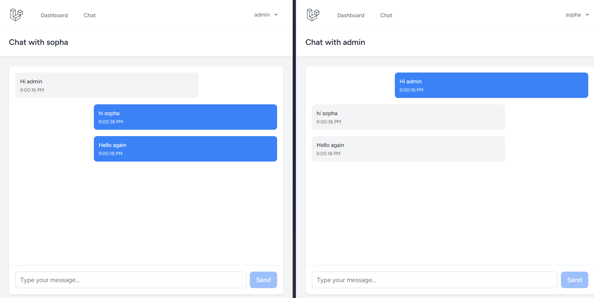

# Laravel Real-Time Chat Application

## About The Project

A real-time chat application built with Laravel, Vue.js, and WebSockets. This application allows users to communicate instantly with features like:

- Real-time message delivery
- User authentication
- Responsive design
- Message history

## Built With

- [Laravel 11](https://laravel.com) - Backend Framework
- [Vue 3](https://vuejs.org) - Frontend Framework
- [Inertia.js](https://inertiajs.com) - Modern Monolith Architecture
- [Laravel Echo](https://laravel.com/docs/broadcasting) - Real-time Events
- [Pusher](https://pusher.com) - WebSocket Provider
- [Tailwind CSS](https://tailwindcss.com) - Styling

## Prerequisites

- PHP >= 8.2
- Composer
- Node.js & NPM >= v18
- SQLite Database

## Installation

1. Clone the repository
